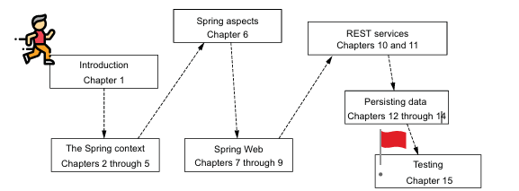

Key ideas of Spring framework:
- simple programming model of Spring framework
- Spring ecosystem
- Learning Spring framework is criticial for Java developers
- I'll encounter this technology in my career
- You can develop applications with Spring framework
- Utilize Spring framework's reference documentation to help you in specific scenarios
- In Enterprise - Spring and ASP.NET Core are often you would encounter
- What are the common pitfalls when working with Spring-based projects?
- Spring Start Here - a must-read for developer starting on their first Spring project
- Almost every applications relies on frameworks
- As a Java Spring is something a developer needs to learn in their first development steps
- Once I feel comfortable with the basics -> start learning an application framework such as Spring framework for Java, ASP.NET Core for .NET ->, React for JavaScript
- Start learning Spring framework application framework as understanding the Spring basics opens doors to learn other technologies such as ASP.NET Core 
- What is Spring context? how does spring context handles beans or components of the applications? 
- how to practice configuring spring context
- What are Spring aspects and what are they used for?
- How to implement data exchange between apps (i.e, JSON, XML, etc)
- how to practice implementing web apps?
- how to persist data and what are the common object-relational mappers of Spring?
- what is the repository design pattern?
- how to do write unit tests in Spring
- For a Java developer, Spring framework is a must-know
- focus on the goal of upskilling
- practice building the examples while I'm reading the book to reinforce and internalize your learnings
- How does Spring becomes aware of my application or the components of my application?
- What is Spring Context?
- What is Spring Web?
- how to create REST services in Spring?
- It's essential to start with theoritical since I have little to no experience with Spring

- Spring Context -> Spring aspects -> Spring Web -> REST services -> Persisting data -> testing
- it's important to get started with the framework
- read additional resources and books to broaden your perspective on the topics on Spring
- practice writing your example and write your solutio once you write your solution compare it to the author's solution - focus on deliberate practice and coming up with your solution
- foucs on understiang the internalizing the concepts you are learning
- Spring projects are often built with Maven - a tool that I can use to manage Spring projects
- Use IntelliJ IDEA is recommended IDE to work and write with Spring projects
- test REST endpoints with Postman and cURL
- use PostgreSQL and pgAdmin to work with PostgreSQL databases

- Foundations that enable the Spring framework -> Spring context and Sprng aspects
- all Spring's capabilities rely on Spring context and Spring aspects
- crucial working with a Spring framework -> context also known as application context in a Spring app
context -> a place in the momemory of the app where i add the object instances that i want the framework to manage
- by default, Spring doesn't know any of the objects I've define in my application
- to enable spring to see my objects I need to add them to the application context in a Spring app or define them as a Bean
- Spring uses the instances (objects) in the context to connect my app to various functionalities Spring provides
- learning what Spring context is and how Spring context works is the first step learning to use Spring
- The focus on practicing to use Spring context and learning to use Spring context
- in Laravel it is similiar to Laravel service container for managing class dependencies and performing dependency injection
- you can think of dependency injection as injecting kung ano kailangan na class ang ang objects niya to function via constructor (usual), or may cases na sa setter methods
- how to add object instances to the Spring context
- not all the objects of an app need to be managed by Spring, i don't need to add all the object instances of my app to the Spring context